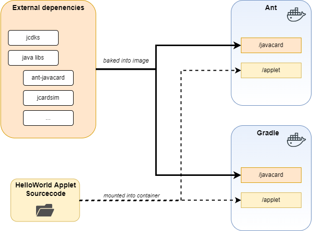

# docker + javacard = why ?!

Why you ask? Well I don't know either.

But the main reasons are I needed it and:
* I don't want to taint my host system with JCDKs from the early 2000s
* I don't want to fiddle around with a multitude of system environment variables to build a cap file
* I don't want to maintain all this for Linux and Windows hosts
* You get the idea... ;)


This repoository takes all the dependencies needed to build a `HelloWorld` applet
with the `ant` or the `gradle` toolchain.

It's meant for local development by mapping the applets sourcecode into the
running containers but is also capable to run in a typical CI/CD pipeline.

Just map the applet into `/applet` and run your tests.


# Overview




# the `docker compose` way

This repo is build around `docker compose` to easily handle multiple docker images and build files sharing dependencies.

To start it jsut run start any service defined in `docker-compose.yml` and 
the appropriate image should automatically be build.

## ant

Start container:
* `docker compose run --rm -ti javacard-gradle`

Run tests:
* `ant test`

```
javacard@4618e2d2a546:/applet$ ant test
Buildfile: /applet/build.xml
...
BUILD SUCCESSFUL
Total time: 1 second
```
Build applet:
* `ant applet`

```
javacard@d7825490cfe0:/applet$ ant applet
Buildfile: /applet/build.xml
      [cap] CAP saved to /applet/build/helloworld.cap
...
BUILD SUCCESSFUL
Total time: 1 second
```

## gradle 

Start container:
* `docker compose run --rm -ti javacard-gradle`

Run tests:
* `gradle test`

```
gradle@8aa816b693a5:/applet/helloworld$ gradle test
...
BUILD SUCCESSFUL in 2s
3 actionable tasks: 2 executed
```
Build applet:
* `gradle buildJavaCard`

```
gradle@3e496b0ab649:/applet$ gradle buildjavacard
...
BUILD SUCCESSFUL in 3s
1 actionable task: 1 executed
```


# the `docker` way

When you don't want to use fancy `docker-compose.yml` and need barebones docker containers just use the steps below.

## build
If you want you can build the images by hand via

For ant:
* `docker build -t javacard-ant -f docker/ant.Dockerfile .`

For gradle:
* `docker build -t javacard-gradle -f docker/gradle.Dockerfile .`

## run

For example (keep in mind to map your volumes manually now)
* `docker run --rm -ti $PWD/examples/ant/helloworld:/applet javacard`


# USB image to install applets to physical card

To finally install the build cap file on a physical card 
you can use the `javacard-usb` docker image.

In the `docker-compose.yml` maps the hosts systems `/dev/bus/usb`
into the container so the cardreader can be accessed.


List cardreaders with `pcsc_scan`
```
root@55557e33ca3f:/applet# pcsc_scan 
Using reader plug'n play mechanism
Scanning present readers...
0: Alcor Micro AU9540 00 00
 
Sun Jun  5 18:14:09 2022
 Reader 0: Alcor Micro AU9540 00 00
  Event number: 1
  Card state: Card removed, 
```


Query the card with `globalplatformpro`
```
root@a14755c4d73f:/javacard# java -jar gp.jar -list
Warning: no keys given, using default test key 404142434445464748494A4B4C4D4E4F
ISD: A000000151000000 (OP_READY)
...
```

# Sources

* Oracle Javacard SDKs  https://github.com/martinpaljak/oracle_javacard_sdks
* GlobalPlatformPro https://github.com/martinpaljak/GlobalPlatformPro
* Ant Javacard https://github.com/martinpaljak/ant-javacard
* Gradle Template https://github.com/crocs-muni/javacard-gradle-template-edu
* jcardsim https://github.com/licel/jcardsim
* Inspiration https://github.com/MrSuicideParrot/Make-JavaCards-Great-Again
* HelloWorld Applet https://github.com/devrandom/javacard-helloworld
